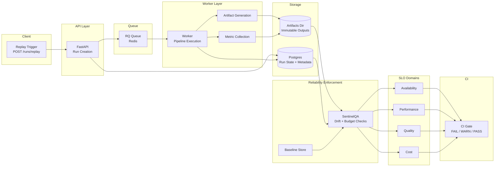

# SignalForge — AI Reliability System

[](https://github.com/john-gaspar/signalforge/actions/workflows/ci.yml) [](https://github.com/john-gaspar/signalforge/actions/workflows/perf.yml)

---

## Why this exists

AI systems rarely fail loudly.  
They degrade silently — through drift, schema changes, latency creep, cost growth, or subtle lifecycle edge cases.

SignalForge encodes those risks into enforceable contracts.

This repository is a practical exploration of what it means to *own reliability* for AI-style systems:

- Can you replay runs deterministically?  
- Can you prove artifacts haven’t changed shape?  
- Can you detect quality regression before it ships?  
- Can you enforce cost and latency budgets automatically?  
- Can you reason about system state transitions formally?

If the answer is not enforced in CI, it doesn’t count.

---

## What this proves

SignalForge demonstrates system-level ownership of AI reliability — beyond testing and into governance:

- Deterministic replay with cryptographic artifact fingerprinting
- Baseline-controlled regression governance (drift + benchmark enforcement)
- CI-enforced reliability gates across schema, graph, metrics, and SLO domains
- Explicit run lifecycle state machine with contract validation
- Error-budget thinking applied to quality, latency, and cost
- Production-style failure injection and invariant enforcement

This repository is designed to show system-level reliability engineering — not surface-level automation.

This project is intentionally opinionated. It prioritises determinism, invariants, and enforceable boundaries over feature velocity.

## Architecture



## CI pipeline

```mermaid
flowchart LR
  checkout[Checkout + snapshot guard] --> env[Write .env - sentinelqa.ci.write_env]
  env --> build[Build images]
  build --> start[Start postgres/redis/neo4j]
  start --> waitpg[Wait TCP postgres:5432]
  waitpg --> migrate[Alembic upgrade head]
  migrate --> services[Start api + worker]
  services --> health[Wait api health - sentinelqa.ci.wait_http]
  health --> seed[Seed run via API]
  seed --> gpstatic[Graph preflight - static]
  gpstatic --> gpruntime[Graph preflight - runtime]
  gpruntime --> gates[Gate runner - graph -> bench -> dq -> qa -> schema -> metrics]
  gates --> pytest[Pytest]
  pytest --> down[Compose down]
```



## Gates matrix

| Gate | What it enforces | Where it runs | Command | Typical failure meaning |
| --- | --- | --- | --- | --- |
| Graph invariants | Neo4j projection completeness + edge rules | CI (runner), Local | `docker compose run --rm api python -m sentinelqa.gates.graph_gate` | Missing nodes/edges or idempotency break |
| Benchmark | Pass rate, p95 latency, F1 vs `bench_baseline.json` | CI (runner), Local | `docker compose run --rm api python -m sentinelqa.gates.bench_gate` | Regression vs benchmark baseline |
| Data Quality + Drift | Fixture/schema validity, drift vs `drift_baseline.json` | CI (runner), Local | `docker compose run --rm api python -m sentinelqa.dq.run` | Drift or invalid artifacts |
| Metrics QA | Latency/alerts thresholds | CI (runner), Local | `docker compose run --rm api python sentinelqa/gates/gate.py` | Metrics below thresholds |
| Schema compatibility | Backward compatibility vs `schemas_baseline/v1` | CI (runner), Local | `docker compose run --rm api python -m sentinelqa.gates.gate_schema_compat` | Breaking schema change |
| Artifact schema | JSON schema validity for artifacts | CI (runner), Local | `docker compose run --rm api python -m sentinelqa.gates.gate_artifact_schema` | Artifact shape mismatch |
| Failure injection | Tamper/fault detection (optional env gate) | CI (runner) | `docker compose run --rm api python -m sentinelqa.gates.gate_failure_injection` | Tamper not detected |
| Deterministic replay | Fingerprint equality across replays | CI (runner) | `docker compose run --rm api python -m sentinelqa.gates.gate_deterministic_replay` | Non-deterministic artifacts |
| Run contract | Run lifecycle + required artifacts | CI (runner), Local | `docker compose run --rm api python -m sentinelqa.gates.gate_run_contract` | Missing artifacts or illegal status path |
| Manifest integrity | Hashes + fingerprint of artifacts | CI (runner), Local | `docker compose run --rm api python -m sentinelqa.gates.gate_manifest_integrity` | Manifest/file hash mismatch |
| SLO | Run metadata completeness + duration budget | CI (runner), Local | `docker compose run --rm api python -m sentinelqa.gates.gate_slo` | SLO/metadata missing |

## Intentional Quick Start

This quick start is not just about running the system.  
It demonstrates deterministic replay + CI parity.

The goal is to:  
1. Start infrastructure  
2. Execute a replayed run  
3. Validate artifact fingerprint stability  
4. Verify gates would pass in CI

### 1️⃣ Build and start infrastructure

```bash
docker compose build
docker compose up -d postgres redis neo4j
```

### 2️⃣ Apply schema (authoritative via Alembic)

```bash
docker compose run --rm api alembic upgrade head
```

### 3️⃣ Start API + worker

```bash
docker compose up -d api worker
```

### 4️⃣ Seed a deterministic run (CI parity path)

```bash
docker compose run --rm api python -m sentinelqa.ci.seed_run --base-url http://api:8000
```

### 5️⃣ Verify deterministic fingerprint

```bash
python -m sentinelqa.cli.diagnose --run-id <run_id> --artifacts-dir artifacts
```

If replayed with identical configuration, the fingerprint must remain identical.

Non-determinism is treated as a reliability violation.

---

## Determinism & baselines
- Artifacts live under `artifacts/runs/<run_id>/`; manifest.json captures per-file hashes and a fingerprint for determinism.
- Baselines: `sentinelqa/baselines/bench_baseline.json`, `sentinelqa/baselines/drift_baseline.json`, `sentinelqa/baselines/load_baseline.json` (perf). Thresholds/tolerances are explicit; changes must be intentional.
- Gate runner (`python -m sentinelqa.gates.runner`) executes the ledgered gate order and writes `gates.json` alongside artifacts for auditability.


## Security Notes
- .env is never committed; it is generated via `python -m sentinelqa.ci.write_env --path .env`.
- docker-compose uses dev-only default credentials; override via environment for CI/production.
- Artifacts directory (`artifacts/**`) is gitignored; only baselines and schemas are tracked.
- Secrets stay in env/CI secrets; repository contains no embedded keys.
