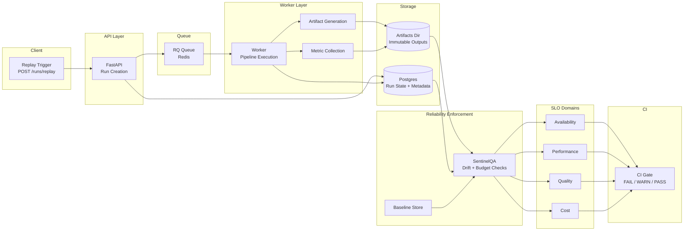

# SignalForge — AI Reliability System

[](https://github.com/john-gaspar/signalforge/actions/workflows/ci.yml) [](https://github.com/john-gaspar/signalforge/actions/workflows/perf.yml)

## What this proves
- Deterministic replay pipeline
- Artifact contract enforcement (schema gate)
- Baseline-controlled drift detection
- CI-enforced reliability gates (graph, bench, DQ, metrics)
- Scheduled performance enforcement

## Architecture



## CI pipeline


## Gates matrix

| Gate | What it enforces | Where it runs | Command | Typical failure meaning |
| --- | --- | --- | --- | --- |
| Graph invariants | Neo4j projection completeness + edge rules | CI (runner), Local | `docker compose run --rm api python -m sentinelqa.gates.graph_gate` | Missing nodes/edges or idempotency break |
| Benchmark | Pass rate, p95 latency, F1 vs `bench_baseline.json` | CI (runner), Local | `docker compose run --rm api python -m sentinelqa.gates.bench_gate` | Regression vs benchmark baseline |
| Data Quality + Drift | Fixture/schema validity, drift vs `drift_baseline.json` | CI (runner), Local | `docker compose run --rm api python -m sentinelqa.dq.run` | Drift or invalid artifacts |
| Metrics QA | Latency/alerts thresholds | CI (runner), Local | `docker compose run --rm api python sentinelqa/gates/gate.py` | Metrics below thresholds |
| Schema compatibility | Backward compatibility vs `schemas_baseline/v1` | CI (runner), Local | `docker compose run --rm api python -m sentinelqa.gates.gate_schema_compat` | Breaking schema change |
| Artifact schema | JSON schema validity for artifacts | CI (runner), Local | `docker compose run --rm api python -m sentinelqa.gates.gate_artifact_schema` | Artifact shape mismatch |
| Failure injection | Tamper/fault detection (optional env gate) | CI (runner) | `docker compose run --rm api python -m sentinelqa.gates.gate_failure_injection` | Tamper not detected |
| Deterministic replay | Fingerprint equality across replays | CI (runner) | `docker compose run --rm api python -m sentinelqa.gates.gate_deterministic_replay` | Non-deterministic artifacts |
| Run contract | Run lifecycle + required artifacts | CI (runner), Local | `docker compose run --rm api python -m sentinelqa.gates.gate_run_contract` | Missing artifacts or illegal status path |
| Manifest integrity | Hashes + fingerprint of artifacts | CI (runner), Local | `docker compose run --rm api python -m sentinelqa.gates.gate_manifest_integrity` | Manifest/file hash mismatch |
| SLO | Run metadata completeness + duration budget | CI (runner), Local | `docker compose run --rm api python -m sentinelqa.gates.gate_slo` | SLO/metadata missing |

## Determinism & baselines
- Artifacts live under `artifacts/runs/<run_id>/`; manifest.json captures per-file hashes and a fingerprint for determinism.
- Baselines: `sentinelqa/baselines/bench_baseline.json`, `sentinelqa/baselines/drift_baseline.json`, `sentinelqa/baselines/load_baseline.json` (perf). Thresholds/tolerances are explicit; changes must be intentional.
- Gate runner (`python -m sentinelqa.gates.runner`) executes the ledgered gate order and writes `gates.json` alongside artifacts for auditability.

## Deterministic fingerprint example

Commands (local CI-parity):
```bash
docker compose build
docker compose up -d postgres redis neo4j
docker compose run --rm api alembic upgrade head
docker compose up -d api worker
docker compose run --rm api python -m sentinelqa.ci.seed_run --base-url http://api:8000
python -m sentinelqa.cli.diagnose --run-id 80294c1eaa340d4262d8e8ddd3c57879 --artifacts-dir artifacts
```

Sample output (real run):
```
Run: 80294c1eaa340d4262d8e8ddd3c57879
Manifest: fingerprint=b24a7d79c19a1d4dec5db20b2b7f3ea206ef9ae265bc3b07034eeefa11c48e0b files=5
Evidence files:
- artifacts/runs/80294c1eaa340d4262d8e8ddd3c57879/manifest.json
```

## Security Notes
- .env is never committed; it is generated via `python -m sentinelqa.ci.write_env --path .env`.
- docker-compose uses dev-only default credentials; override via environment for CI/production.
- Artifacts directory (`artifacts/**`) is gitignored; only baselines and schemas are tracked.
- Secrets stay in env/CI secrets; repository contains no embedded keys.
