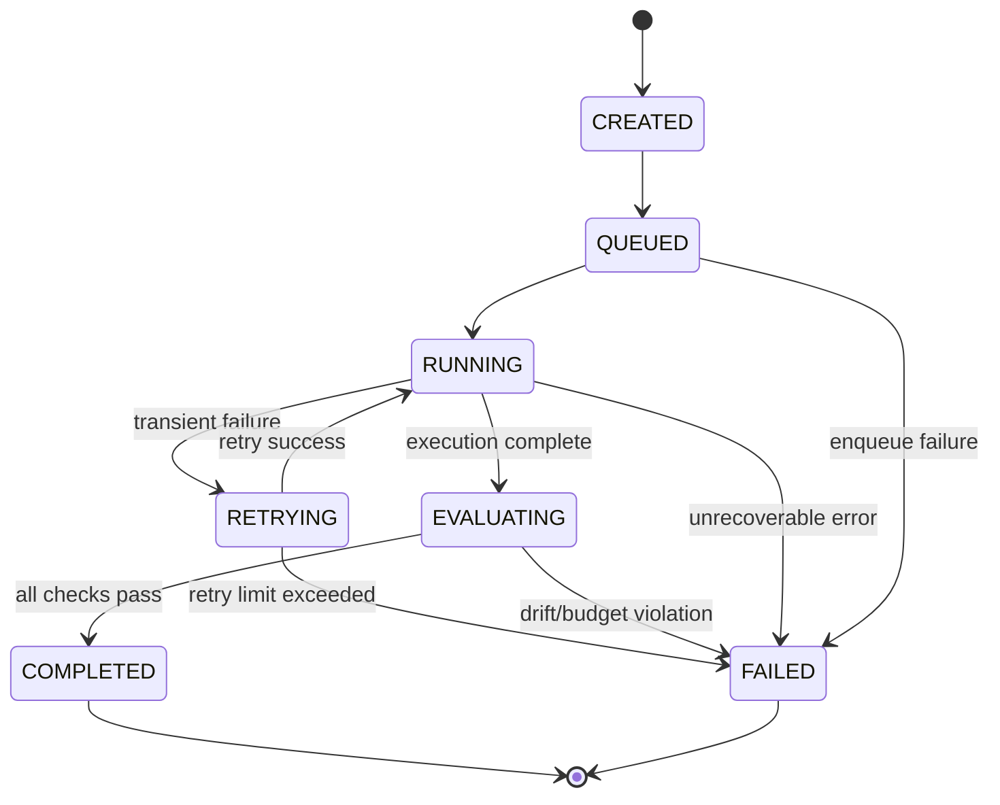

# Run Lifecycle State Machine

## Objective

Define explicit, deterministic lifecycle semantics for a SignalForge run.

This state machine ensures:

- No partial-success ambiguity
- No silent failure
- Bounded retries
- Atomic state transitions
- Production-grade execution guarantees

Each run exists in exactly one state at any time.  
All transitions must be explicit and atomic.

---

# Lifecycle Diagram

---

# State Definitions

## CREATED
- Run persisted
- Input schema validated
- Not yet enqueued

Invariant:
No worker execution has occurred.

---

## QUEUED
- Job successfully enqueued
- Awaiting worker execution

Invariant:
Run must exist in queue system.

Failure Handling:
Queue unavailability → API returns 503 and run is not created.

---

## RUNNING
- Worker actively processing
- Artifacts generated
- Metrics captured

Invariant:
Run has assigned worker and active execution context.

Failure Handling:
Exceptions captured.
Retry policy evaluated.

---

## RETRYING
- Transient failure detected
- Retry counter incremented
- Backoff applied

Constraints:
- Max retry limit enforced
- No infinite retry loops

If retry limit exceeded:
→ FAILED

---

## EVALUATING
- Structural invariants validated
- Drift detection executed
- Error budgets evaluated
- Cost/latency budgets enforced

Invariant:
Artifacts are immutable at this stage.

Failure Handling:
Any FAIL-level violation → FAILED

---

## COMPLETED (Terminal)
- All structural checks pass
- Drift within tolerance
- Budgets respected
- No FAIL-level violations

Invariant:
Run is eligible for baseline comparison.

---

## FAILED (Terminal)

Possible causes:

- Structural invariant violation
- Drift threshold exceeded
- Budget violation
- Worker execution error
- Retry limit exceeded

Invariant:
FAILED runs cannot transition to COMPLETED.
Rerun required.

---

# Allowed Transitions

Only the following transitions are valid:

- CREATED → QUEUED
- QUEUED → RUNNING
- RUNNING → RETRYING
- RETRYING → RUNNING
- RUNNING → EVALUATING
- EVALUATING → COMPLETED
- Any active state → FAILED

No backward transitions permitted.

All transitions must be atomic database updates.

---

# Idempotency Guarantees

- Re-processing same `run_id` must not duplicate artifacts
- Worker restarts must not corrupt state
- Partial artifact writes must never result in COMPLETED
- Terminal states are immutable

---

# Observability Requirements

Each state transition must emit structured logs including:

- run_id
- previous_state
- new_state
- timestamp
- correlation_id
- model_id
- dataset_version

Metrics must track:

- Time spent per state
- Retry count distribution
- Failure rate by state
- Evaluation failure reasons

---

# Reliability Properties Enforced

This state machine guarantees:

- Deterministic execution lifecycle
- Bounded retry semantics
- Clear failure accountability
- CI-enforced regression control
- No silent degradation pathways

SignalForge is an operable AI reliability system — not a replay script.